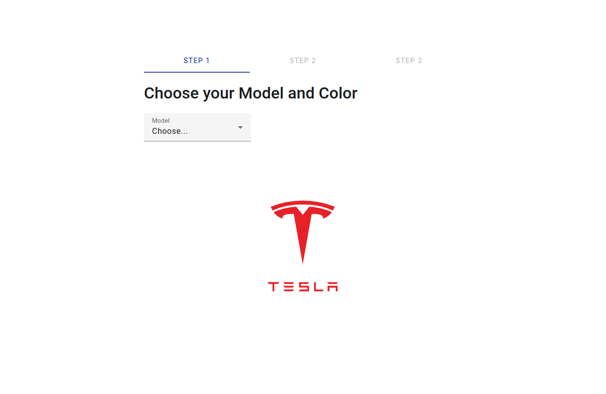

# Tesla Configurator
This project is a code assignment from [Angular Training](https://www.angulartraining.com) for the Angular certification level 2 (intermediate).

Because the focus of the assignment is on Angular functionality, the website has only one layout.

## Tech Stack
- Angular 17
- Sass

## Main Features
- API (mocked with [msw](https://github.com/mswjs/msw))
- Standalone Components
- Router Guards
- RxJS
- Angular Material

## Developer Tools
- VS Code
- GitHub Copilot

## Screenshot

## About Tesla
This project mimics portions of the [official Tesla website](https://www.tesla.com/modelx/design#overview) and is not affiliated with or endorsed by Tesla, Inc.

Tesla is a registered trademark of Tesla, Inc.

The Tesla logo used in this project is sourced from [Wikimedia Commons](https://commons.wikimedia.org/wiki/File:Tesla_Motors.svg).

## Copyright
© 2024 Johnny Gérard
